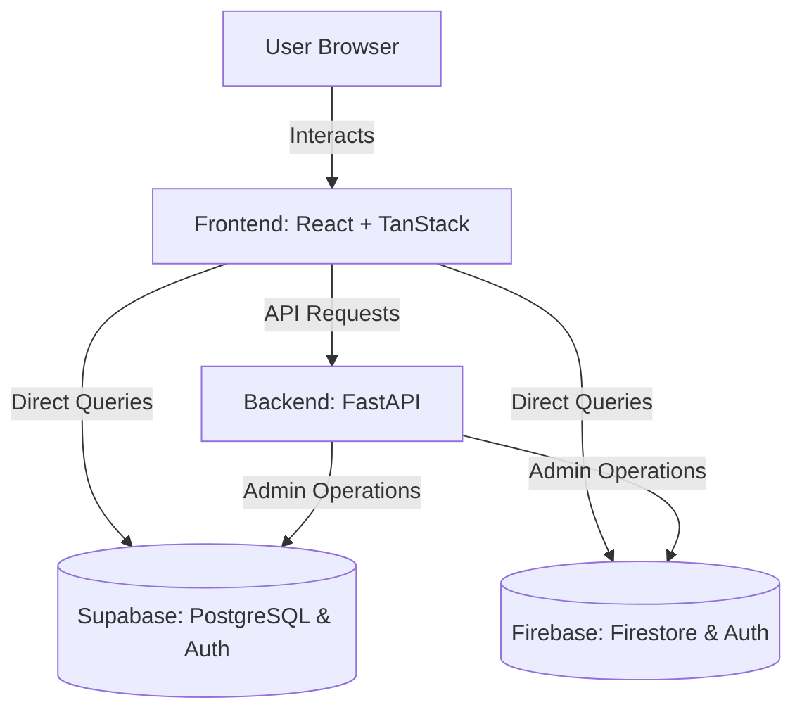

# System Architecture - DeadlinePilot AI

This document describes the architectural design and component interaction of the DeadlinePilot AI platform.

---

## 🏗️ High-Level Overview

DeadlinePilot AI is designed as a modular, decoupled application consisting of:
1. **Frontend**: A React single-page application built with TanStack Start/Router for client-side rendering and routing.
2. **Backend**: A Python-based REST API built with FastAPI, providing machine learning predictions, database operations, and business logic.
3. **Database & Services**: Dual integration capability for Supabase (PostgreSQL) and Firebase (Firestore, Hosting, and Auth).

---

## 💻 Frontend Architecture (`/frontend`)

The frontend is a modern React application using **TanStack Start**:
- **Routing**: Declared using file-based routing in `src/routes/`.
- **State Management**: Managed via **Zustand** for local UI state and **TanStack Query** for server-state caching.
- **Styling**: Tailwind CSS with custom theme configurations.
- **Integrations**: Fully modularized integrations for auth and database APIs.

---

## 🐍 Backend Architecture (`/backend`)

The backend is a high-performance Python application built with **FastAPI**:
- **API Framework**: FastAPI provides automatic OpenAPI/Swagger documentation, fast execution, and asynchronous endpoints.
- **Validation**: Pydantic models are used for request/response serialization and strict type validation.
- **AI Engine**: Houses predictive models that calculate project risks and estimate deadline completion confidence.
